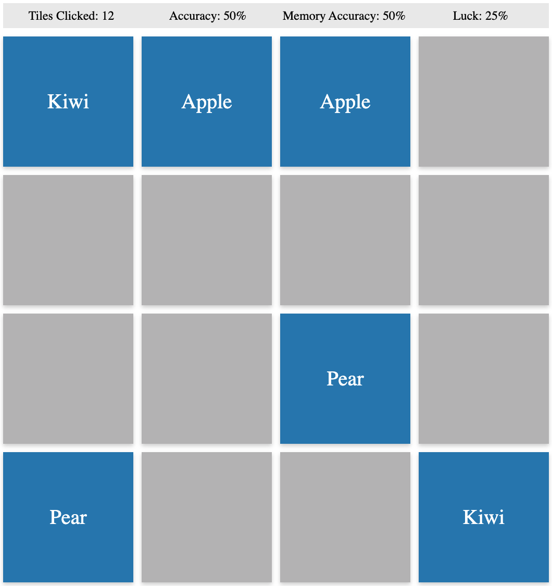

# Memory Game
An in browser Python-based memory game.


## Build
```shell
$ ./build.py
```

## Run
Open the built artifact (index.html) in your browser of choice.

## Customize
Edit the tile list to changes the tiles in the game.
